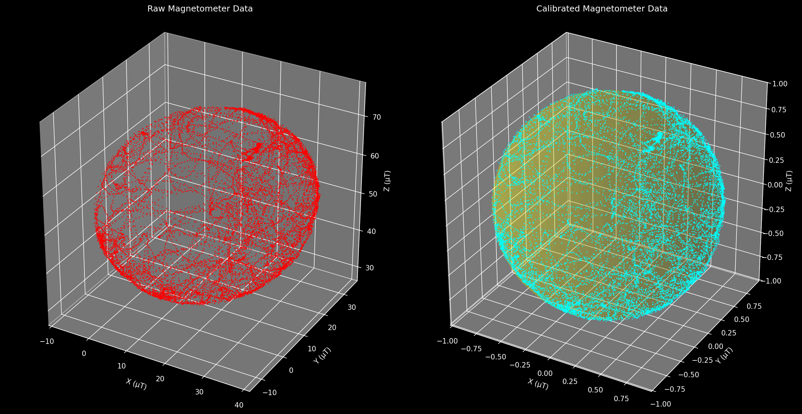

# RM3100 Flight Magnetometer Driver

A flight-grade magnetometer driver for the PNI RM3100 sensor with comprehensive calibration tools for satellite and aerospace applications.



## 🚀 Features

- **Flight-Ready Driver**: Robust SPI communication with error handling
- **Real-time Data Logging**: CSV output with live 3D visualization
- **Advanced Calibration**: Ellipsoid fitting with hard/soft iron correction
- **Multiple Output Formats**: JSON, C headers, and calibrated datasets
- **Quality Assessment**: Sphericity metrics and validation plots

## 📋 Table of Contents

- [Hardware Setup](#hardware-setup)
- [Building the Driver](#building-the-driver)
- [Data Collection](#data-collection)
- [Calibration Process](#calibration-process)
- [Integration Guide](#integration-guide)
- [API Reference](#api-reference)

## 🔌 Hardware Setup

### Wiring Diagram


### Pin Connections

| Raspberry Pi Pico | RM3100 | Function |
|-------------------|--------|----------|
| GPIO 2            | SCK    | SPI Clock |
| GPIO 3            | MOSI   | SPI Data Out |
| GPIO 4            | MISO   | SPI Data In |
| GPIO 5            | CS     | Chip Select |
| 3.3V              | VDD    | Power Supply |
| GND               | GND    | Ground |

### Hardware Requirements

- **Microcontroller**: Raspberry Pi Pico (RP2040)
- **Sensor**: PNI RM3100 3-axis magnetometer
- **Interface**: SPI (1 MHz max)
- **Power**: 3.3V operation
- **Current**: ~260µA @ 75Hz (typical)

## 🛠️ Building the Driver

### Prerequisites

```bash
# Install Pico SDK
git clone https://github.com/raspberrypi/pico-sdk.git
export PICO_SDK_PATH=/path/to/pico-sdk

# Install toolchain (if not already installed)
# On macOS:
brew install --cask raspberry-pi-imager
# Follow Pico setup guide for your platform
```

### Compilation

```bash
# Clone the repository
git clone https://github.com/yourusername/rm3100-flight.git
cd rm3100-flight

# Create build directory
mkdir build && cd build

# Configure and build
cmake ..
make -j4

# Flash to Pico
# 1. Hold BOOTSEL button while connecting USB
# 2. Copy rm3100.uf2 to the Pico drive
```

### CMakeLists.txt Configuration

```cmake
# Key dependencies
target_link_libraries(rm3100
    pico_stdlib
    hardware_spi
    hardware_gpio
)

# Enable USB stdio for data output
pico_enable_stdio_usb(rm3100 1)
pico_enable_stdio_uart(rm3100 0)
```

## 📊 Data Collection

### Running the Driver

1. **Flash the firmware** to your Pico
2. **Connect via serial** (115200 baud)
3. **Collect data** while rotating the sensor

```bash
# Connect to serial port (macOS/Linux)
screen /dev/tty.usbmodem* 115200

# Or use the Python logger
python scripts/rm3100_logger.py --port /dev/tty.usbmodem*
```

### Expected Output

```csv
Timestamp(ms),M_x(µT),M_y(µT),M_z(µT),M_total(µT)
1234567,25.123,-15.456,45.789,54.321
1234577,25.234,-15.345,45.678,54.234
...
```

### Data Collection Tips

- **Rotate slowly** in all orientations (tumbling motion)
- **Collect 2000+ points** for best calibration
- **Avoid magnetic interference** (phones, computers, etc.)
- **Use consistent environment** throughout collection

## 🎯 Calibration Process

### Using the Calibration Tool

```bash
# Install Python dependencies
pip install numpy pandas matplotlib scipy

# Run calibration on collected data
python scripts/rm3100_calibration.py --input rm3100_data_20241201_123456.csv

# Or specify custom output directory
python scripts/rm3100_calibration.py \
    --input your_data.csv \
    --output my_calibration_results
```

### Calibration Quality Metrics

| Sphericity Score | Quality | Action Required |
|------------------|---------|-----------------|
| > 0.95 | ✅ Excellent | Ready for flight |
| > 0.90 | ✅ Good | Acceptable |
| > 0.80 | ⚠️ Fair | Consider more data |
| < 0.80 | ❌ Poor | Recollect data |

### Output Files

The calibration process generates:

```
calibration_output/
├── calibration_results.png           # Before/after visualization
├── rm3100_calibration_20241201_123456.json    # Parameters (JSON)
├── rm3100_calibration_20241201_123456.h       # C header file
└── rm3100_calibrated_data_20241201_123456.csv # Corrected dataset
```

## 🔧 Integration Guide

### Using the Generated C Header

```c
#include "rm3100_calibration_20241201_123456.h"

// In your main loop
rm3100_data_t raw_data;
if (rm3100_get_reading(&raw_data) == RM3100_OK) {
    float cal_x, cal_y, cal_z;
    
    // Apply calibration
    rm3100_apply_calibration(raw_data.x, raw_data.y, raw_data.z,
                            &cal_x, &cal_y, &cal_z);
    
    // Use calibrated values for attitude determination
    attitude_update(cal_x, cal_y, cal_z);
}
```

### Calibration Matrix Math

The calibration transforms raw measurements using:

```
X_calibrated = M * (X_raw - offset)
```

Where:
- `M` is the 3x3 soft iron correction matrix
- `offset` is the 3x1 hard iron bias vector

This corrects for:
- **Hard Iron**: DC magnetic fields from nearby ferrous materials
- **Soft Iron**: Scale factors and axis rotations from field distortions

## 📚 API Reference

### Core Functions

#### `rm3100_init()`
Initializes the RM3100 sensor and SPI interface.

**Returns:** `rm3100_error_t` - Error code (RM3100_OK on success)

**Configuration:**
- SPI: 1 MHz, Mode 0 (CPOL=0, CPHA=0)
- Cycle Count: 200 (75 LSB/µT resolution)
- Sample Rate: 75 Hz continuous mode
- Axes: X, Y, Z enabled

#### `rm3100_get_reading(rm3100_data_t* data)`
Reads the latest magnetometer data.

**Parameters:**
- `data`: Pointer to data structure for results

**Returns:** `rm3100_error_t` - Error code

**Data Structure:**
```c
typedef struct {
    float x, y, z;           // Magnetic field in µT
    float magnitude;         // Total field magnitude
    uint64_t timestamp_ms;   // Measurement timestamp
    bool valid;              // Data validity flag
} rm3100_data_t;
```

### Error Codes

| Code | Description |
|------|-------------|
| `RM3100_OK` | Success |
| `RM3100_ERROR_SPI_COMM` | SPI communication failure |
| `RM3100_ERROR_WRONG_CHIP_ID` | Sensor not detected |
| `RM3100_ERROR_CONFIG_FAILED` | Configuration error |
| `RM3100_ERROR_NO_DATA_READY` | No new data available |
| `RM3100_ERROR_INVALID_PARAM` | Invalid parameter |

## 📈 Performance Specifications

### Sensor Characteristics

| Parameter | Value | Unit |
|-----------|-------|------|
| **Resolution** | 13 nT | (CC=200) |
| **Noise** | 15 nT RMS | (CC=200) |
| **Range** | ±800 | µT |
| **Sample Rate** | 75 | Hz |
| **Power** | 260 | µA |
| **Interface** | SPI | 1 MHz max |

### Flight Heritage

- **Tested Environment**: Thermal cycling, vibration, EMI
- **Update Rate**: Configurable 1-600 Hz
- **Deterministic Timing**: Non-blocking reads
- **Error Recovery**: Automatic sensor reconnection
- **Memory Usage**: < 2KB RAM

## 🔍 Troubleshooting

### Common Issues

**No sensor detected:**
- Check wiring connections
- Verify 3.3V power supply
- Ensure SPI pins configured correctly

**Poor calibration quality:**
- Collect more data points (>2000)
- Rotate sensor in all orientations
- Remove magnetic interference sources
- Use consistent temperature environment

**Noisy readings:**
- Check power supply stability
- Verify SPI signal integrity
- Reduce electromagnetic interference
- Consider lower sample rates

### Debug Output

Enable debug output by uncommenting debug prints in the driver:
```c
printf("Attempting to connect to RM3100...\n");
```

---

**Built for space missions. Tested for reliability. Ready for flight.** 🛰️